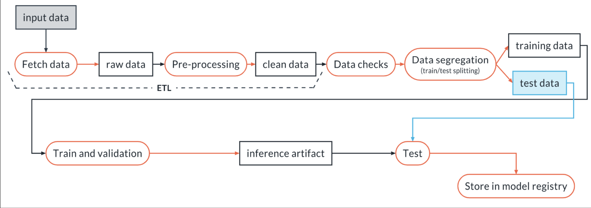

# ChurnModelPipeline
This is a sample project showcasing a pipeline for training a churn prediction model. 
The data for this project comes from Kaggle and can be found [here](https://www.kaggle.com/datasets/muhammadshahidazeem/customer-churn-dataset/).
As a pre-pipeline step, I combined the train and test sets together into a single file and replaced the Customer ID column. I then zipped the data and stored that in this repo. This pipeline was developed with the goal of automation and reusability of the individual components. 

# Pipeline Process
The pipeline process is visualized below. Each bubble corresponds to a step in the pipeline, and the rectangles are artifacts produced by the pipeline components which are put into an artifact registry before being used in subsequent pipeline components. 

This pipeline and its components are ML Flow projects. I use Weights & Biases for storing pipeline artifacts. And I use Hydra for managing parameters, testing components, and its capability to create multiple jobs simultaneously, which is useful for hyperparameter tuning. Each step in the pipeline is implemented by running a script in its own conda environment.

Let's go over the individual components:

### Fetch Data
Implemented by **download**. This will download the zipped dataset, and store it in artifact store. No other preprocessing is done yet.

### Pre-processing
Implemented by **preprocess**. This will take the zipped dataset, unzip it, drop duplicate rows and perform minimal feature engineering. This cleaned data is stored in artifact store. *TODO: Make feature engineering a separate step that can be done in a feature store. Or, put this in the inference object*. 

### Data Checks
Implemented by **check_data**. This will perform some sanity checks on the data to make sure the columns take reasonable values. It also uses a two sample Kolmogorov-Smirnov test to assess data drift. 

### Data Segregation
Implemented by **segregate**. Performs a train test split on the data, and stores the datasets into artifact store. 

### Train and Validation
Implemented by **random_forest**. This will use the training data to build a model, log metrics, and export useful charts including a confusion matrix and feautre importance chart. 

### Test
Implemented by **evaluate**. Evaluates the inference object on the train set. 

## Running the Pipeline
To run the pipeline, navigate to within the pipeline directory, and run:

	> conda env create -f environment.yml
	> conda activate churn_pred_example

Next log in to WandB and run:

	> wandb login [your API key]

next simply run:

	>mlflow run .

Hydra can be used to change the parameters. 